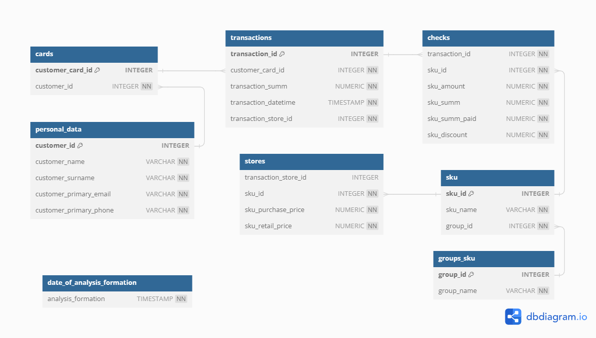

# Примеры скриптов для аналитики розничных продаж

## Содержание
- [Содержание](#содержание)
- [Описание](#описание)
- [Установка](#установка)
- [Использование](#использование)
- [Схема](#схема)

## Описание

Этот проект представляет собой коллекцию скриптов для работы с базой данных PostgreSQL, предназначенных для аналитики розничных продаж. Он включает примеры для создания и управления таблицами, функциями, процедурами, представлениями и ролями, а также примеры миграций и импорта данных.


## Установка

1. Клонируйте репозиторий:
    ```sh
    git clone https://github.com/LKarataev/pg-retail.git
    ```
2. Перейдите в директорию проекта:
    ```sh
    cd pg-retail
    ```
3. Создайте базу данных и выполните миграции:
    ```sh
    psql -f db/migrations/000_set_datestyle.sql
    psql -f db/migrations/001_create_tables/*.sql
    psql -f db/migrations/002_create_migration_procedures/*.sql
    psql -f db/migrations/003_import_data/*.sql
    ```

## Использование

1. Запустите PostgreSQL и подключитесь к вашей базе данных.
2. Выполните необходимые SQL-скрипты для создания и заполнения таблиц, функций, процедур и представлений.
3. Используйте предоставленные функции и процедуры для анализа данных.

## Схема

